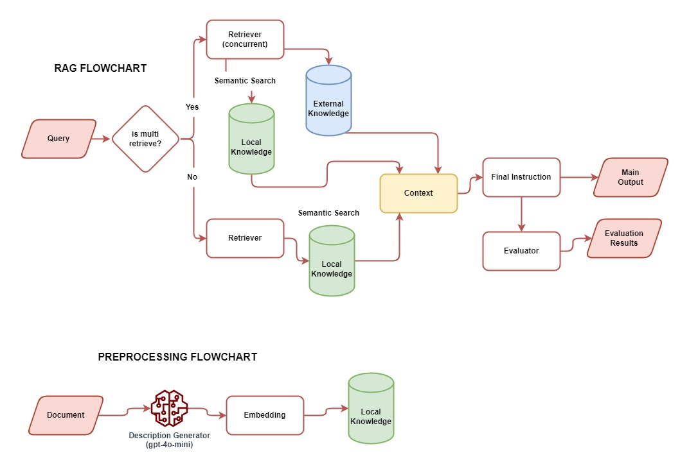

# 📚 LinkAja Internal Q&A RAG System

This project is an internal chatbot system using LLMs (Large Language Models) and Retrieval-Augmented Generation (RAG) to provide accurate answers to questions using LinkAja's internal FAQ database. It also supports optional external search via Google (SERPAPI).

---

## 🚀 Key Features

- 🔍 **Retrieval Modes**:  
  - `Single`: retrieves from internal FAQ only.  
  - `Multi`: retrieves from both internal FAQ and external Google Search.

- 🤖 **LLM Integration**: Based on OpenAI GPT (can be replaced with other models if needed).

- 🧠 **Preprocessing Pipeline**:
  - Generates short descriptions for each FAQ entry.
  - Embeddings are computed based on `question + description` for stronger semantic context.

- 🎯 **Answer Evaluation**:
  - Relevance
  - Accuracy
  - Completeness
  - Clarity
  - Conciseness

- 💻 **Streamlit UI**:
  - Sidebar settings for retrieval mode (single/multi).
  - Chat interface and answer evaluation panel.

---

## 📈 System Flowchart



## 🗂️ Project Structure

```bash
.
├── agent
│   ├── base_agent.py
│   ├── final_instruction_agent.py
│   ├── impartial_evaluator_agent.py
│   ├── main_agent.py
│   └── prompt_template.py
├── app.py
├── data
│   ├── faq_embeddings.pkl
│   ├── faq.json
│   └── faq_preprocessed.json
├── Dockerfile
├── k8s
├── preprocessing
│   ├── generate_description.py
│   ├── prompt_template.py
│   └── README.md
├── README.md
├── requirements.txt
├── retriever
│   ├── embed_documents.py
│   ├── local_retriever.py
│   └── web_retriever.py
```

---

## ⚙️ Setup and Installation

### 1. Create `.env` File

Create a `.env` file in the root directory:

```
OPENAI_API_KEY=your_openai_key
SERPAPI_API_KEY=your_serpapi_key
```

### 2. Install dependencies

```bash
pip install -r requirements.txt
```

### 3. Run the application

```bash
streamlit run app.py
```

---

## 🐳 Docker & Kubernetes

### 🔧 Docker

A `Dockerfile` is provided for containerization. You can build and run the container using:

```bash
docker build -t linkaja-qa .
docker run --name c-linkaja-qa --env-file .env -p 8501:8501 -d linkaja-qa
```

### ☸️ Kubernetes Deployment

The `k8s/` folder contains manifest files for Kubernetes deployment:

- `deployment.yaml`: Defines the deployment with 2 replicas.
- `service.yaml`: Exposes the deployment as a Kubernetes service.
- `secret.yaml`: Manages your `.env` API keys securely.

### 📄 Kubernetes Deployment Instructions

1. Create a secret from the `.env` file:

```bash
kubectl create secret generic linkaja-env --from-env-file=.env
```

2. Apply the manifests:

```bash
kubectl apply -f k8s/
```

---

## 📏 Evaluation Metrics

| Metric       | Description                                              |
|--------------|----------------------------------------------------------|
| Relevance    | Is the answer related to the question?                   |
| Accuracy     | Is the content factually correct?                        |
| Completeness | Does it fully answer the question?                       |
| Clarity      | Is the answer easy to understand?                        |
| Conciseness  | Is the answer brief and to the point?                    |

---

## ❌ Exception Handling

- Ambiguous questions → agent will request clarification.
- No relevant results → fallback answer will be returned.
- Missing/invalid API keys → handled with clear error messages and logs.

---

## 💡 Technical Notes

- **No FAISS**: Manual vector search using NumPy for low memory overhead.
- **No LangChain**: Fully custom and modular native implementation.
- **Code Quality**: Modular, documented, and clean codebase.

## 📷 Screenshots & Video Recording

All screenshots and demo video recordings are available in the `assets/` folder for reference.